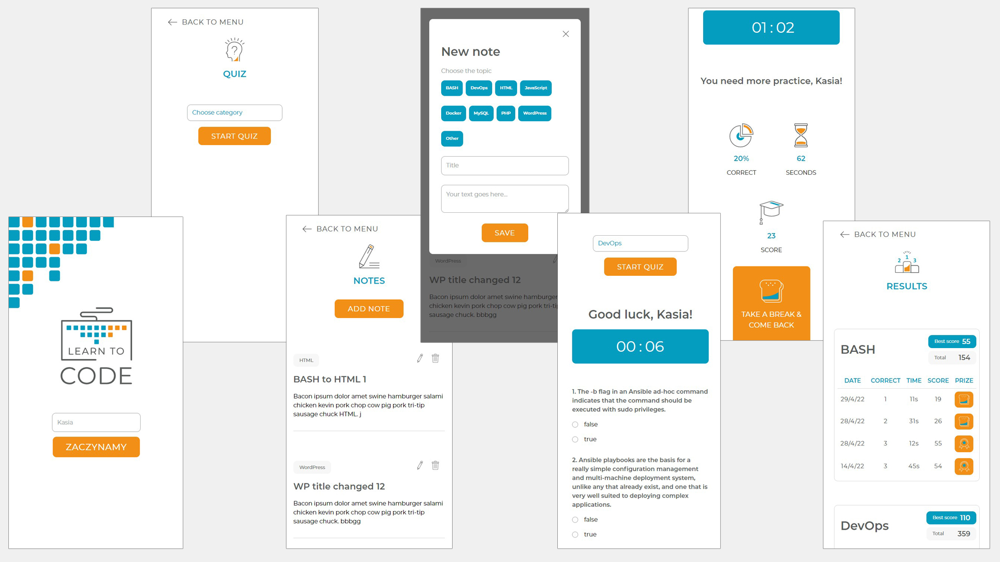
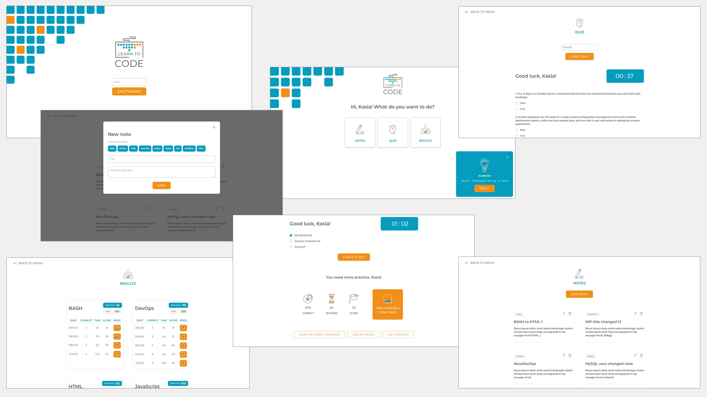

# LEARN-TO-CODE-app-with-quiz

This is my final exam project made in CodersLab School (course: JavaScript Frontend Developer with React).

## App sections

1. Home with a basic "logging panel" demanding user name only
2. Main section with menu:
3. Notes - list of notes, possibility to add new notes, edit or delete existing notes
4. Quiz - category select, new quiz import, timer, result summary, possibility to check correct answers and save quiz result.
5. Results - tables with saved quiz results

## Technologies used

* [React](https://reactjs.org/) - project initiated with [Create React App](https://github.com/facebook/create-react-app)
* [React router](https://reactrouter.com/docs/en/v6)
* React Hooks
* [REST API](https://quizapi.io/)
* [Firebase](https://firebase.google.com/)
* [SCSS](https://sass-lang.com/documentation)
* [Styled Components](https://styled-components.com/) - for dropdown select in quiz section
* Flexbox
* RWD
* AdobeXD [Here](https://xd.adobe.com/view/aef40d2b-9a08-41b3-8622-740ae76be35f-fba7/grid) you can see an 
illustrative version of my project (it has been changing in the meantime)

## Screenshots

## Deployed on vercel.com

[https://learn-to-code-app.vercel.app/](https://learn-to-code-app.vercel.app/)

#### Author: Katarzyna Knapowska